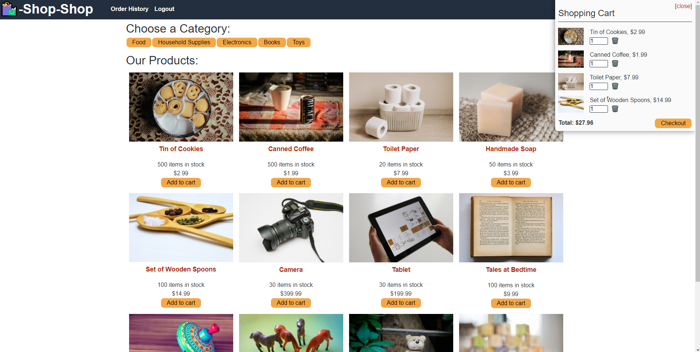

# Shop-Shop-Redux 

## Description 
Shop-Shop-Redux is an e-commerce MERN application that utilizes Apollo, Redux, GraphQL and Stripe to facilitate a smooth, user-friendly online shopping experience.

 ## Link to Deployed Application
* [Shop-Shop-Redux](https://shop-shop-redux-max.herokuapp.com/)
### User Story
* AS AN avid reader
* I WANT to search for new books to read
* SO THAT I can keep a list of books to purchase 

## Table of Contents
* [Installation](#installation) 
* [Usage](#usage) 
* [License](#license) 
* [Contributing](#contributing)
* [Questions](#questions)

## Link to Github Repository
* [Shop-Shop-Redux](https://github.com/mplumer/shop-shop-redux)

 
### Installation
Follow the deployed application link: https://shop-shop-redux-max.herokuapp.com. 

### Usage
The homepage displays a full list of products. Click on the category tabs to sort products by category. Sign up for an account to gain access to the shopping cart and place orders.  

### License
MIT
  
### Contributing
Shop-Shop-Redux is an open source project that was built from cloned, front-end starter code at the University of Texas Web Development Bootcamp, and anyone is encouraged to contribute by cloning or forking the code and working to improve its function and versatility.

### Questions
    
##### Interested in other projects from this developer? Visit the following GitHub page:
https://github.com/mplumer
    
##### Send any questions to the following email address:
mplumer12@yahoo.com
